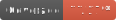

# Staff-Relations Team 16

## Team Members
- 2546838
- 2569109 
- 2544456
- 2548549
- 2621684
- 2539340

## Application URL
[Click here](https://jolly-ocean-04e2df210.5.azurestaticapps.net/) to be taken to the web application.

## Vanilla JavaScript App
[Azure Static Web Apps](https://docs.microsoft.com/azure/static-web-apps/overview) allows you to easily build JavaScript apps in minutes. Use this repo with the [quickstart](https://docs.microsoft.com/azure/static-web-apps/getting-started?tabs=vanilla-javascript) to build and customize a new static site.

This repo is used as a starter for a _very basic_ HTML web application using no front-end frameworks.

## Local Setup
- This repo has a dev container. This means if you open it inside a [GitHub Codespace](https://github.com/features/codespaces), or using [VS Code with the remote containers extension](https://code.visualstudio.com/docs/remote/containers), it will be opened inside a container with all the dependencies already installed.
- In order to run the application locally use the following command: **swa start ./src --data-api-location swa-db-connections**

## Repo Navigation
- The [**src**](src) folder contains all relevant js, html and css files for the project.
- The [**testing**](testing) folder contains all relevant js files for tests.
- The [**coverage**](coverage) folder includes all relevent files generated from testing.
- The [**swa-db-connections**](swa-db-connections) folder contains the database configuration. 

### **Lines:**  
### **Branches:**  
### **Functions:**  
### **Statements:**   
